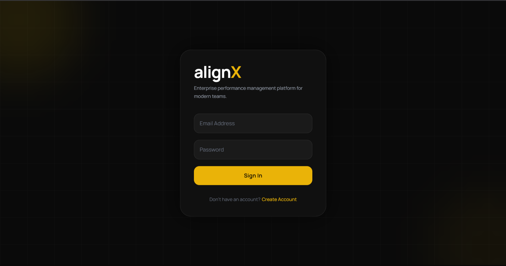
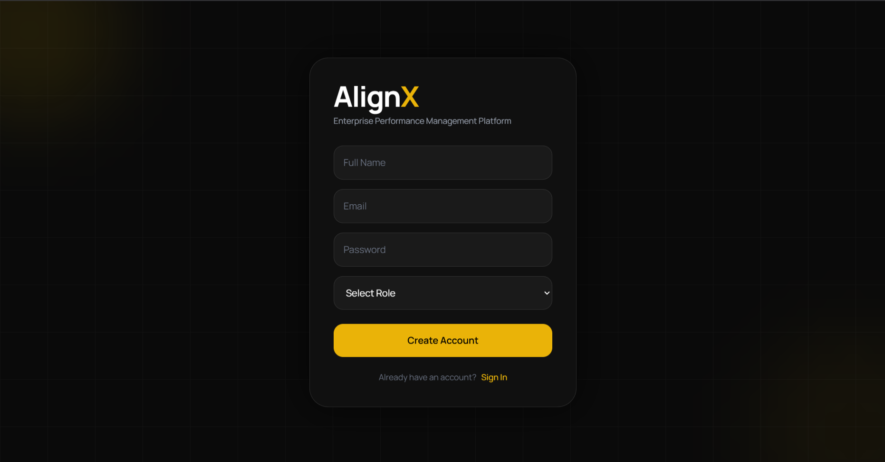
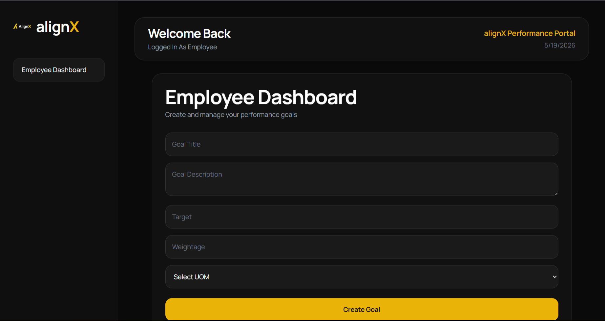
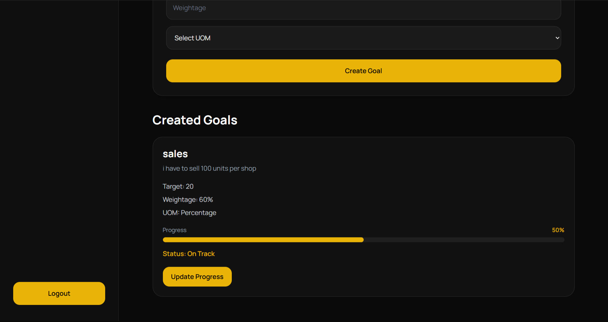
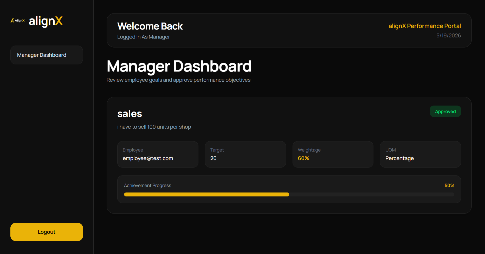
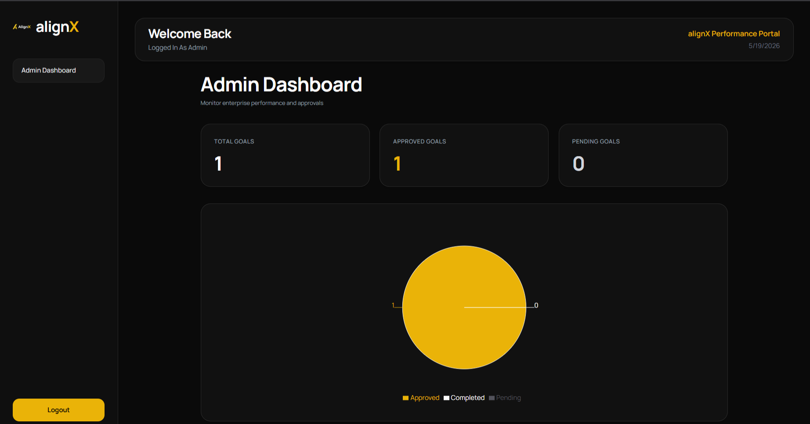

# AlignX

Enterprise Performance Management Platform built for modern organizations.

---

## Overview

AlignX is a role-based performance management platform where employees can create goals, managers can review and approve them, and administrators can monitor analytics and organizational performance.

The platform is designed with a modern enterprise workflow using a sleek dark UI inspired by premium SaaS dashboards.

---

# Features

## Authentication System
- Secure Login and Signup
- Role-based Access Control
- JWT Authentication
- Persistent Sessions using Local Storage

---

## Employee Dashboard
- Create performance goals
- Set target, weightage, and unit of measurement
- Update achievement progress
- Track goal completion status
- Visual progress tracking with progress bars
- Goal validation rules

### Validation Rules
- Maximum 8 goals allowed
- Total weightage cannot exceed 100%
- Minimum goal weightage is 10%
- Negative targets are restricted

---

## Manager Dashboard
- Review employee goals
- Approve performance goals
- Monitor employee achievements
- Track progress visually
- Real-time approval updates

---

## Admin Dashboard
- Organizational analytics overview
- Goal statistics monitoring
- Pie chart visualizations
- Approved vs Pending tracking
- Enterprise-level monitoring dashboard

---

# Tech Stack

## Frontend
- React.js
- Tailwind CSS
- Axios
- React Router DOM
- Recharts

## Backend
- Node.js
- Express.js
- MongoDB
- Mongoose
- JWT Authentication
- bcrypt.js

## Deployment
- Frontend: Vercel
- Backend: Render
- Database: MongoDB Atlas

---

# UI Design

The application follows:
- Dark enterprise theme
- Minimal and modern design system
- Responsive layouts
- Premium dashboard aesthetics
- Glassmorphism-inspired interface

---

# Project Structure

```bash
alignx/
│
├── frontend/
│   ├── src/
│   │   ├── components/
│   │   ├── pages/
│   │   ├── assets/
│   │   ├── App.jsx
│   │   └── main.jsx
│
├── backend/
│   ├── routes/
│   ├── models/
│   ├── middleware/
│   ├── server.js
│   └── .env
│
├── screenshots/
│
└── README.md
````

---

# Installation

## 1. Clone Repository

```bash
git clone https://github.com/TejjasAR/alignx.git
```

---

## 2. Install Frontend Dependencies

```bash
cd frontend
npm install
```

---

## 3. Install Backend Dependencies

```bash
cd backend
npm install
```

---

# Environment Variables

Create a `.env` file inside the backend folder.

```env
MONGO_URI=your_mongodb_connection
JWT_SECRET=your_secret_key
PORT=5000
```

---

# Run Project

## Start Backend

```bash
cd backend
npm start
```

---

## Start Frontend

```bash
cd frontend
npm run dev
```

---

# Deployment

## Frontend

Deploy using:

* Vercel

## Backend

Deploy using:

* Render

## Database

Use:

* MongoDB Atlas

---

# Screenshots

## Login Page



---

## Signup Page



---

## Employee Dashboard




---

## Manager Dashboard



---

## Admin Dashboard



---

# Future Improvements

* Email notifications
* KPI scoring system
* AI-based performance analytics
* Notification system
* PDF report generation
* Goal deadline tracking
* Team performance insights
* Employee leaderboard

---

# Developed By

## Tejjas A R

Engineering Student | Full Stack Developer

GitHub:
[https://github.com/TejjasAR](https://github.com/TejjasAR)

---

# Support

If you found this project useful, consider giving the repository a star on GitHub.

```
```
